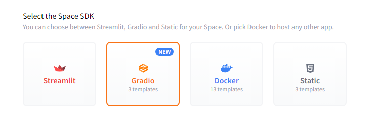
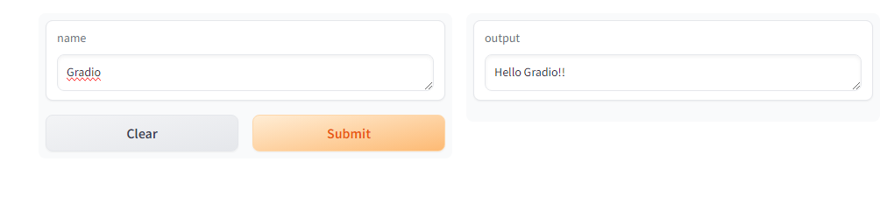
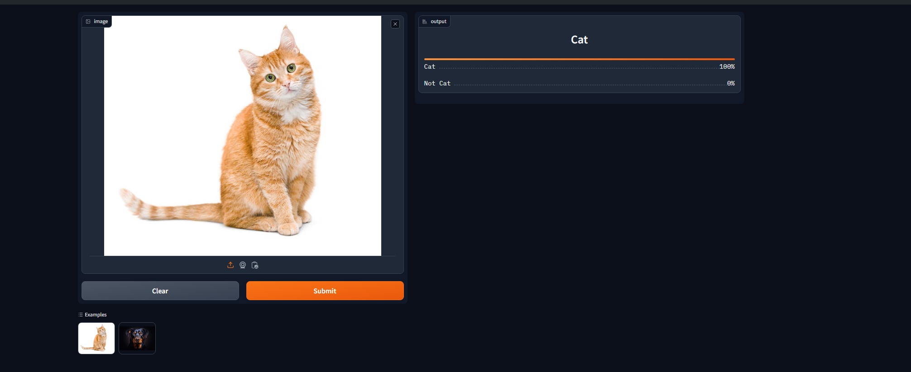

This article will provide a quick introduction to create & deploy a Machine Learning Model and to integrate with React application.
Here is an overview of technologies we will be using

[Hugging Face](https://huggingface.co/) is a platform where we can host Machine Learning Models and Create Spaces to use them with any of the models available.

[Gradio](https://www.gradio.app/) is a platform which enables to build user interfaces for interacting with or demoing our Machine Learning models.

## Create a Space in Hugging Face

Let's start by creating a space of hugging face [here](https://huggingface.co/new-space). Choose a name for the space and under Spaces SDK choose Gradio



You can leave the other options as default and proceed to create space. Clone the created spaces to your machine and create `app.py ` with the following contents

```python
import gradio as gr

def greet(name):
    return "Hello " + name + "!!"

demo = gr.Interface(fn=greet, inputs="text", outputs="text")
demo.launch()
```

Once these are are done, commit and push your changes to your space. Hugging face should build this automatically and shows the gradio interface of our app like this



Now we have built a gradio app with basic interface and hosted it in hugging face spaces. Let's look into extending the functionality our app in the next section.

_Note: You need to create a write token [here](https://huggingface.co/settings/tokens) in order to push your changes to hugging face spaces_

## Create a Vision Classifier Model

We are going to use [fast.ai](https://docs.fast.ai/) to create a simple classification which predicts whether a given image is a cat or not.

First, let's get path of the training images dataset. fast.ai provides lot of datasets already, we'll use one from that. Here are the steps to train & export the model

```python
# Read the dataset from fastai
 path = untar_data(URLs.PETS)/'images'
 dls = ImageDataLoaders.from_name_func(
        path,get_image_files(path), valid_pct=0.2, seed=42,
        label_func=is_cat, item_tfms=Resize(224))

# Train the model with vision_learner
 learn = vision_learner(dls, resnet34, metrics=error_rate)
 learn.fine_tune(1)

# Export the model
 learn.path = Path('.')
 learn.export(
 'cats_classifier.pkl')


```

After you have run this, there should be a model file generated in the same directory. You can then use this for predictions.

```python
model = load_learner('cats_classifier.pkl')

def predict(image):
     img = PILImage.create(image)
     _,_,probs = model.predict(img)
     return {'Not a Cat':float("{:.2f}".format(probs[0].item())),
            'Cat':float("{:.2f}".format(probs[1].item()))}


```

Then launch gradio using the predict method above

```python
demo = gr.Interface(fn=predict, inputs=gr.Image(), outputs='label')
demo.launch()
```

To see your changes in action, push your changes to hugging face.

_Note: Since the size of the generated model will be large, you need to use [Git LFS](https://git-lfs.com/) to track the changes_

Then you should able to upload any image and find if its a cat or not



# Integrate with React application

One of the advantages of using gradio is that, it gives us an API to access our model. We will look into how to integrate it with React.

If you scroll to bottom in our deployed model in hugging face, you can see a button called `use via Api` where you will find the details to connect to the api. We will be using `@gradio/client` package to connect to api. Here is the sample code to connect to model & get the results

```javascript
import { Client } from "@gradio/client";

const response = await fetch(
	"https://raw.githubusercontent.com/gradio-app/gradio/main/test/test_files/bus.png",
);

const exampleImage = await response.blob();

const client = await Client.connect("ganesh1410/basic-classifier");
const result = await client.predict("/predict", {
	image: exampleImage,
});

// This should have the label and confidences
console.log(result.data);
```

You can see it in action for our model here


Here are the links for all the code & demo

- [Demo of Hugging Face with Gradio](https://huggingface.co/spaces/ganesh1410/basic-classifier)
- [Code used for Hugging Face Model with Gradio](https://huggingface.co/spaces/ganesh1410/basic-classifier/tree/main)
- [Demo and Code of React app with our trained model](https://codesandbox.io/p/devbox/pedantic-knuth-9cm66p)
